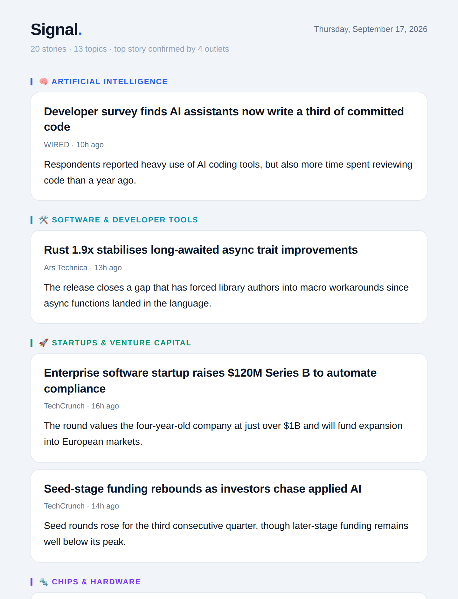
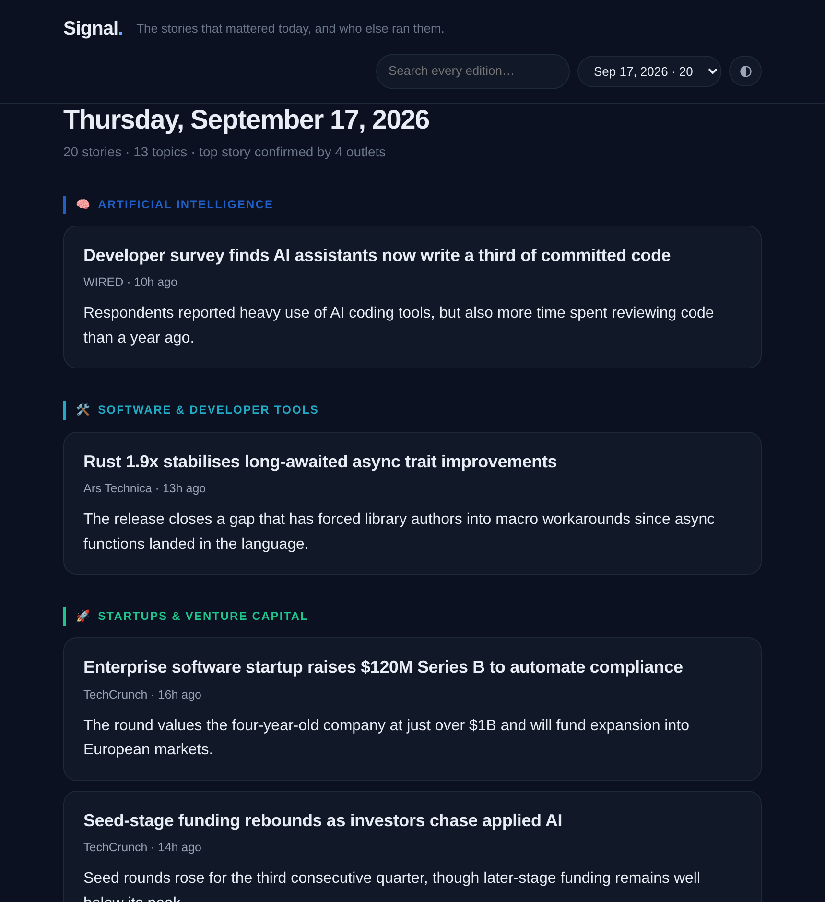

<div align="center">

# Signal

**One digest a day. The same story from five outlets, merged into one entry — with the five outlets attached.**

[](https://github.com/sxnmit/signal/actions/workflows/ci.yml)
[](https://www.python.org/downloads/)
[](LICENSE)
[](#try-it-in-thirty-seconds)



</div>

---

## The problem with a feed reader

Sixteen feeds will hand you the same Nvidia launch sixteen times. A keyword filter does not help,
because every outlet writes a different headline about it. You end up scrolling past four versions
of one story to find the one story nobody else covered.

Signal inverts that. It **groups articles by event, not by feed**, and the number of outlets that
independently ran a story becomes the strongest signal of whether it mattered:

> **Nvidia announces Rubin GPU, doubling down on inference**
> The Verge · 4h ago &nbsp;`4 outlets`
>
> Nvidia used its developer conference to announce Rubin, the successor to Blackwell, claiming
> roughly double the inference throughput per watt. Analysts read the launch as a defensive move:
> the training market is saturating while inference spending keeps climbing.
>
> <sub>Also covered by Ars Technica · MIT Technology Review · Stratechery</sub>

One entry. Four sources. The summary draws on all of them.

---

## Try it in thirty seconds

No API keys. No account. No network.

```bash
pip install git+https://github.com/sxnmit/signal
signal demo
```

`signal demo` runs the complete pipeline — clustering, ranking, summarising, rendering — over a
bundled sample corpus and prints the result to your terminal. It writes nothing and calls nothing.

Ready for real news:

```bash
signal init          # writes signal.toml you can edit
signal run --dry-run --print
```

That fetches live feeds and builds a real edition, but delivers nothing and records nothing.

---

## What it does

```
  sources          pipeline                    summarize        render/deliver
  ─────────        ────────────────────        ─────────        ──────────────
  RSS / Atom  ─┐   canonicalise URLs      ┐    extractive   ┐   HTML email
  Hacker News ─┼─► drop duplicates        ├─►  (no key)     ├─► terminal
  NewsAPI     ─┘   cluster by event       │    or any       │   markdown
                   route to topics        │    OpenAI- /    │   JSON archive
                   rank and cut           ┘    Anthropic-   ┘   static site
                                               compatible LLM   Slack / Discord
```

**Clustering is the interesting part.** Signal compares headlines with an IDF-weighted blend of
cosine similarity and containment, blocked on rare tokens so the cost stays near-linear. Lexical
similarity alone is not enough, though — an analysis piece titled *"Rubin: Nvidia bets the next era
of AI is about serving, not training"* shares almost no vocabulary with the news report it responds
to. So Signal also extracts a **named-entity vocabulary** across the corpus: two headlines that
both name `nvidia` and `rubin` are covering one event, whatever else they say.

**Ranking happens before summarising**, so the expensive stage only ever sees stories that earned
their place. A run that fetches 600 articles might summarise 20. Each cluster scores on topic
relevance × recency decay × corroboration × source weight.

**Nothing invents a link.** Summarisers receive numbered items and return numbered items. Every URL
in a digest is copied from the article that was actually fetched, so no language model can send you
somewhere that does not exist.

---

## Sources

| Source | API key | Notes |
|---|---|---|
| RSS / Atom | — | 16 feeds out of the box; add your own in `signal.toml` |
| Hacker News | — | Front page above a points threshold, via the public Algolia API |
| NewsAPI | `NEWS_API_KEY` | Optional keyword search layered on top of your feeds |

Every feed is fetched **once per run, in parallel**. A dead feed becomes one warning line, never a
failed run — check them all with `signal sources`.

## Summarisers

| Provider | Config | Notes |
|---|---|---|
| Extractive | *(default)* | No key, no network. Picks the most representative sentences already present in the sources, so it cannot state anything they did not. |
| Groq | `GROQ_API_KEY` | Free tier; the shipped default once a key exists |
| OpenAI / OpenRouter / Together | change `base_url` | Any OpenAI-compatible chat-completions endpoint |
| Ollama / vLLM | `base_url = "http://localhost:11434/v1"` | Fully local |
| Anthropic | `api = "anthropic"` | Native Messages API |

`provider = "auto"` (the default) uses a language model when a key is present and the extractive
summariser when it is not. If the endpoint errors mid-run, Signal falls back per story and finishes
the edition rather than dropping it.

## Delivery

| Channel | Configure with |
|---|---|
| Email | `SENDER_EMAIL`, `SENDER_PASSWORD`, `RECIPIENT_EMAILS` |
| Slack / Discord | `SIGNAL_WEBHOOK_URL` |
| Static site | `signal site` — see below |
| Terminal / Markdown | `signal preview`, `signal demo --format markdown` |

Each recipient gets their own message by default, so addresses are never disclosed to each other.
Gmail requires an [App Password](https://myaccount.google.com/apppasswords), not your account password.

---

## The archive

Every edition is written to `archive/YYYY-MM-DD.json` — small, diffable, and the single durable
record of what Signal has sent. `signal site` renders the whole archive into a static, searchable
website with no framework and no build step:

<div align="center">

</div>

Full-text search across every edition, an edition picker, dark mode, and a permalink per day that
email links can point at. It deploys to GitHub Pages straight from the bundled workflow.

> Search fetches `search.json`, so browsers block it when the page is opened straight off disk.
> Run `python3 -m http.server` inside the output folder to try it locally.

---

## Configuration

`signal init` writes a fully commented `signal.toml`. Everything is optional — anything you leave
out falls back to the packaged defaults, so a real config can be four lines:

```toml
[[topics]]
name = "Formula 1"
icon = "🏎️"
keywords = ["formula 1", "f1", "grand prix", "fia", "mclaren", "ferrari"]
max_stories = 4
```

The knobs worth knowing:

| Setting | Default | What it does |
|---|---|---|
| `dedup.similarity_threshold` | `0.35` | Lower merges more aggressively; raise it if unrelated stories are being grouped |
| `dedup.retention_days` | `90` | How long an article is remembered so it is never sent twice |
| `rank.corroboration_weight` | `0.55` | How much a story gains from being covered by several outlets |
| `rank.recency_half_life_hours` | `18` | How fast a story's recency bonus decays |
| `rank.min_score` | `0.15` | The bar a story clears to be published at all |
| `fetch.window_hours` | `36` | How far back to look |

**Secrets never go in `signal.toml`.** They are read from the environment (or `.env`) at the point
of use, so the config file is always safe to commit. See [`.env.example`](.env.example).

---

## Commands

```
signal demo       Run the whole pipeline on bundled sample data. No keys, no network, no writes.
signal run        Assemble and deliver one edition.  --dry-run  --no-send  --print
signal preview    Show an archived edition.          [DATE]  --format terminal|markdown|html
signal site       Rebuild the static archive site.   --limit N
signal sources    Check that every configured source is reachable.
signal stats      Database and archive statistics.
signal init       Write a starter signal.toml and .env.example.
signal watch      Run on an interval in the foreground.  --hours N
```

## Running it on a schedule

The bundled `.github/workflows/digest.yml` runs daily, commits the new edition, and publishes the
site. Add `GROQ_API_KEY`, `SENDER_EMAIL`, `SENDER_PASSWORD` and `RECIPIENT_EMAILS` as repository
secrets and enable Pages (Settings → Pages → *GitHub Actions*). Or use cron:

```cron
0 12 * * *  cd /path/to/signal && /usr/local/bin/signal run
```

---

## Development

```bash
git clone https://github.com/sxnmit/signal && cd signal
pip install -e ".[dev]"

pytest                       # 268 tests, no network required
ruff check src tests
ruff format src tests
mypy
```

The test suite never opens a socket. Providers are driven through fake sessions, SMTP through a
fake server, and the pipeline through the bundled corpus — so the tests are fast, deterministic,
and still exercise the real code paths.

---

## Upgrading from v1

Signal 2.0 is a rewrite. Your **secrets do not change** — `GROQ_API_KEY`, `NEWS_API_KEY`,
`SENDER_EMAIL`, `SENDER_PASSWORD` and `RECIPIENT_EMAILS` all still work — and an existing
`news_digest.db` is **migrated in place**, send history intact.

What changed, and why:

- **`python main.py --now` is now `signal run`.** The flat scripts are gone; there is one entry point.
- **The database is no longer committed.** v1 pushed a 3 MB SQLite file on every run, which is why
  this repository's history is fifty identical *"Update news database"* commits. The archive JSON is
  now the durable record, and the database is a rebuildable cache.
- **Articles are recorded as sent when they are sent.** v1 recorded them at *fetch* time, so any
  story the summariser passed over was buried permanently. Now a story that misses today's cut stays
  eligible tomorrow, when more outlets may have picked it up.
- **Each recipient gets their own message.** v1 put every address in one `To:` header.
- **The summariser returns JSON.** v1 parsed a bespoke `HEADLINE:` / `---` text format by hand and
  silently dropped stories whenever the model reformatted its answer.
- **Feeds are fetched once per run.** v1 re-parsed every feed once per topic — 16 topics × 16 feeds
  meant 256 downloads for 16 feeds' worth of news.

See [CHANGELOG.md](CHANGELOG.md) for the full list.

---

## License

MIT — see [LICENSE](LICENSE).
